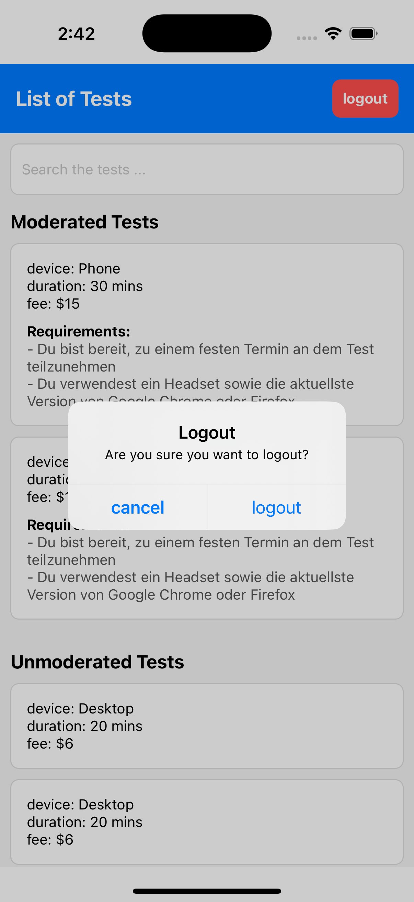

# Application README

## Overview

This application is designed to manage tests in a categorized manner, with a login flow and a tests list screen divided into moderated and unmoderated tests. This document will guide you on how to set up, run, and explore the app on any machine.


---

## Application Flow Screenshots

### 1. Login Screen


### 2. Login Screen - Error State


### 3. Login Screen - Loading State


### 4. Tests List Screen


### 5. Logout Confirmation



---


## Steps to Set Up and Run the Application

### 1. Clone the Repository

```bash
git clone https://github.com/mahmoud-elsadany/Testers_ReactNative.git
```

### 2. Install Dependencies

Ensure you have Node.js installed, then run:

```bash
npm install
```

Or, if you use Yarn:

```bash
yarn install
```

### 3. Configure the Environment

- Create an `.env` file in the root directory if environment variables are needed.
- Add API base URL and other configurations:
  ```
  API_BASE_URL=https://app.rel2.stgrapidusertests.com/api/tester
  ```

### 4. Set Up the Emulator or Device

#### For Android:

- Open Android Studio and launch an Android Virtual Device (AVD).
- Alternatively, connect a physical Android device with USB debugging enabled.

#### For iOS (macOS only):

- Open Xcode and launch an iOS Simulator.
- Alternatively, connect a physical iPhone device.

### 5. Start the Metro Bundler

```bash
npm start
```

Or:

```bash
yarn start
```

### 6. Run the Application

#### For Android:

```bash
npx react-native run-android
```

#### For iOS (macOS only):

```bash
npx react-native run-ios
```

---

## Support

For further assistance, contact [mahmoud-elsadany@hotmail.com](mailto\:mahmoud-elsadany@hotmail.com).

